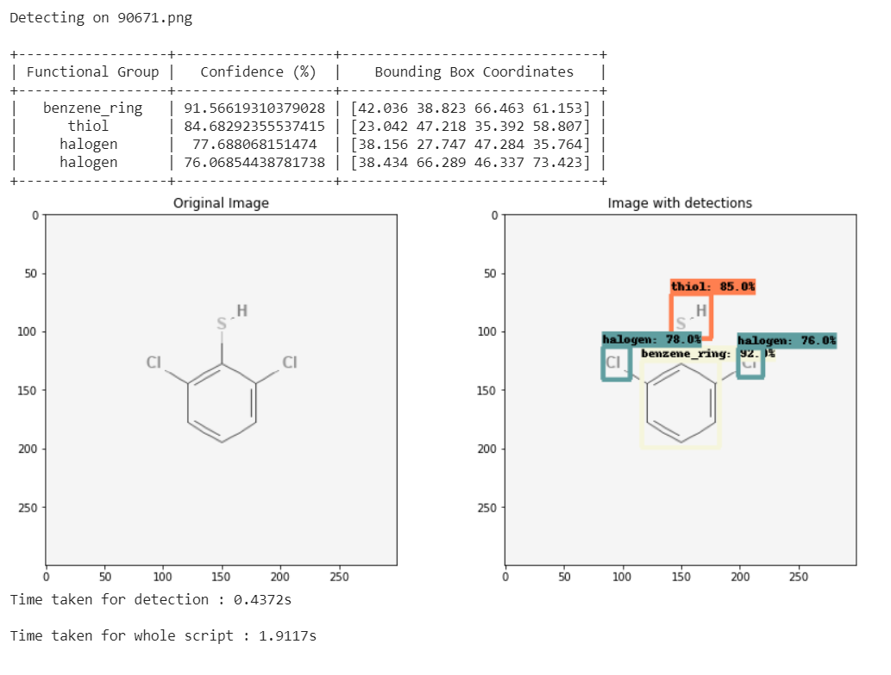

# Functional Group Detector
**An organic functional group detector using Tensorflow's object detection API.**

By Davis Thomas Daniel

Here is a screengrab of one of the detections. 

In organic chemistry, [functional groups](https://en.wikipedia.org/wiki/Functional_group) are specific substituents or moieties 
within molecules that may be responsible for the characteristic chemical reactions of those molecules. The detection of functional groups can aid in the elucidation of reaction mechanisms and the structure of transition states using deep learning techniques.

FG detector is chemical functional group object detector based on Tensorflow object detection API. The main motivation behind this detector was that the existing software for detection of functional groups heavily depends on the use of substructure filtering and is therefore not automated.

The detection model was trained using transfer learning from 'ssd_efficientdet_d0_512x512_coco17_tpu-8'.  

The training dataset comprised of 300x300 sized .png images from PubChem.

Currently, the model detects the following groups : 
* Alcohol
* Aldehyde
* Amine
* Amide
* Carboxylic Acid
* Ester
* Ether
* Ketone
* Double bonds
* Benzene Ring
* Halogen
* Thiol

## Trying out the model

To try out functional group detection using the trained model, first open the notebook titled [FG_detector_v1_detection_test.ipynb](https://github.com/davistdaniel/chemical-functional-group-detector/blob/master/FG_detector_v1_detection_test.ipynb) on [Google Colab](https://colab.research.google.com/).  

**Click [here](https://colab.research.google.com/github/davistdaniel/chemical-functional-group-detector/blob/master/FG_detector_v1_detection_test.ipynb) to directly open the notebook in Google Colab.** 

## Limitations

* The training data sampling is not uniform.
* Therefore, the model is better at detecting :
	* Alcohol
	* Aldehyde
	* Carboxylic Acid
	* Halogen
	* Ether
	* Benzene Ring
	* Double Bond
*  Check the the directory [detection_results_fg_detector_v1](https://github.com/davistdaniel/chemical-functional-group-detector/tree/master/detection_results_fg_detector_v1) for tested images and corresponding detections using the trained model.

* You can see few errors in detections and sometimes the model does not detect all similar groups in the structure, however, this could be solved by a bigger dataset.
* The training was done only for 3.5 hours, using 40000 steps with a batch size of 4.
	
## License
[MIT](https://choosealicense.com/licenses/mit/)

##
